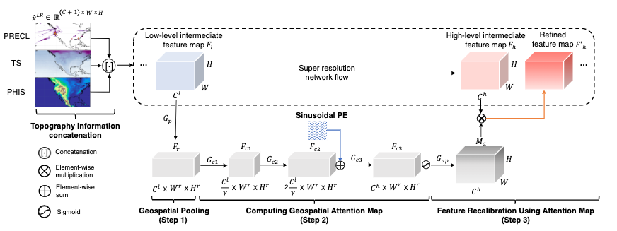
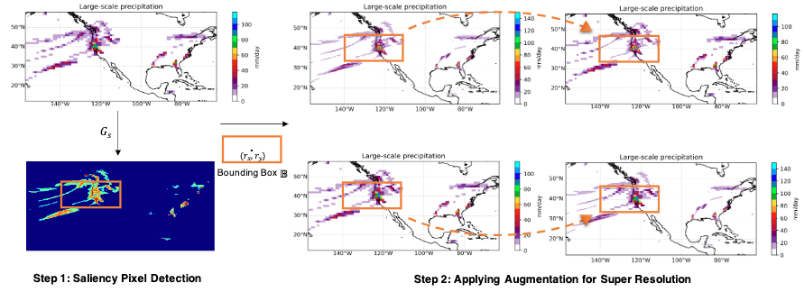

# Upscaling Earth System Models with Deep Learning #
This repo is the PyTorch codes for "Upscaling Earth System Models with Deep Learning"
> [**Upscaling Earth System Models with Deep Learning**]()


## Overall model architecture ##
<center> </center>
<center> </center>

## Usage ##
```
usage: main_srresnet.py [-h] [--channels CHANNELS] [--batchSize BATCHSIZE]
                        [--nEpochs NEPOCHS] [--lr LR] [--step STEP] [--cuda]
                        [--start-epoch START_EPOCH] [--gpus GPUS] [--position]
                        [--cutblur] [--saliency] [--piece PIECE] [--second]
                        [--first] [--r_factor R_FACTOR]
                        [--pos_rfactor POS_RFACTOR] [--pooling POOLING]

config

  -h, --help            show this help message and exit
  --channels CHANNELS   channels to be used
  --batchSize BATCHSIZE
                        training batch size
  --nEpochs NEPOCHS     number of epochs to train for
  --lr LR               Learning Rate. Default=1e-4
  --step STEP           Sets the learning rate to the initial LR decayed by
                        momentum every n epochs
  --cuda                Use cuda?
  --start-epoch START_EPOCH
                        Manual epoch number
  --threads THREADS     Number of threads for data loader to use
  --pretrained PRETRAINED
                        path to pretrained model (default: none)
  --gpus GPUS           gpu ids
  --position            Enable position encoding
  --cutblur             Enable cutblur
  --saliency            Enable saliency detection
  --piece PIECE         pieces
  --second              Apply augmentation on second channel only
  --first               Apply augmentation on first channel only
  --r_factor R_FACTOR   R_FACTOR hyperparameter
  --pos_rfactor POS_RFACTOR
                        POS_RFACTOR hyperparameter
  --pooling POOLING     mean or max
```
```
usage: evaluation.py [-h] [--channel CHANNEL] [--name NAME]
                     [--checkpoint CHECKPOINT]
optional arguments:
  -h, --help            show this help message and exit
  --channel CHANNEL     number of channels to be used
  --name NAME           name of the files
  --checkpoint CHECKPOINT
                        name of the checkpoint dir
```

## Data ##
We provide the data for our experiment. You can download the data using following
[link](http://climatedata.ibs.re.kr/data/cesm-hires)
                     
## Output ##
Currently, we support the output for our model.
| Dataset           | Output | 
|-------------------|---------------|
|2x           | [Download](https://drive.google.com/file/d/1ONJbw6Qnccgl20uN38pS3RgpqeobAWxb/view?usp=sharing)  | 
|4x           | [Download](https://drive.google.com/file/d/1SWXqE5Esu4j4n7QUrL6kbR39Xzb6bgJg/view?usp=sharing)  |
|8x           | [Download](https://drive.google.com/file/d/15lFVyOjZvGbqdZ1R150XL9-SuGgo57kp/view?usp=sharing)  |
